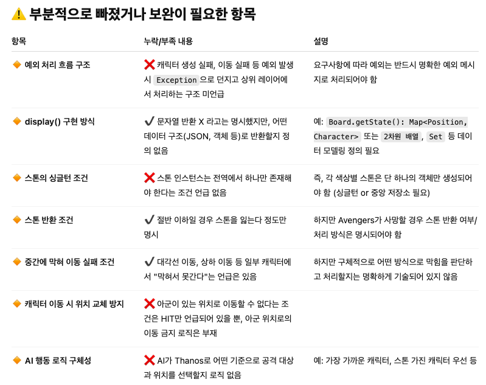
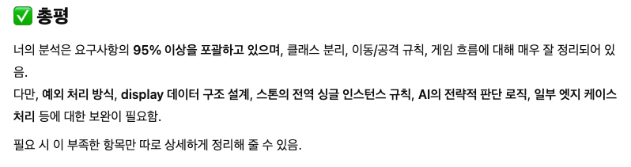
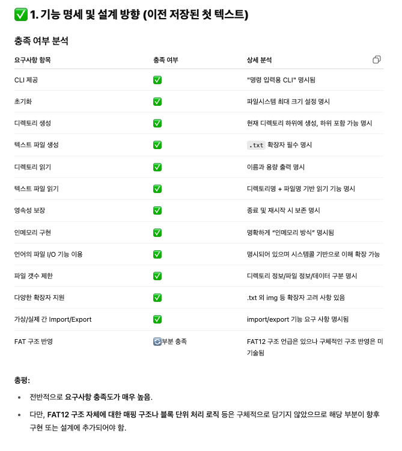
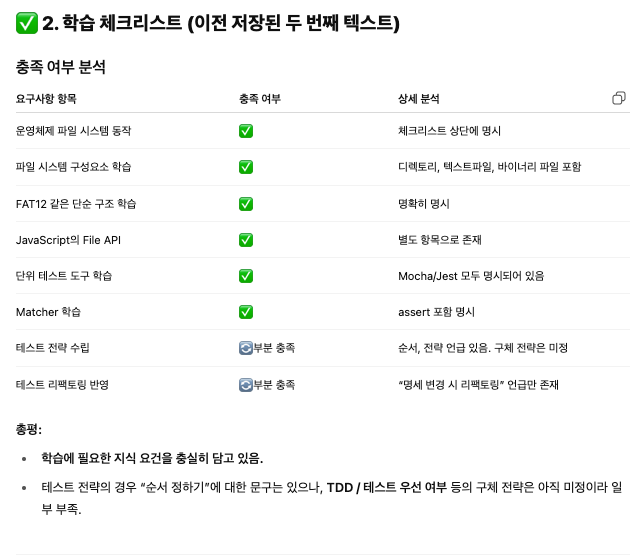
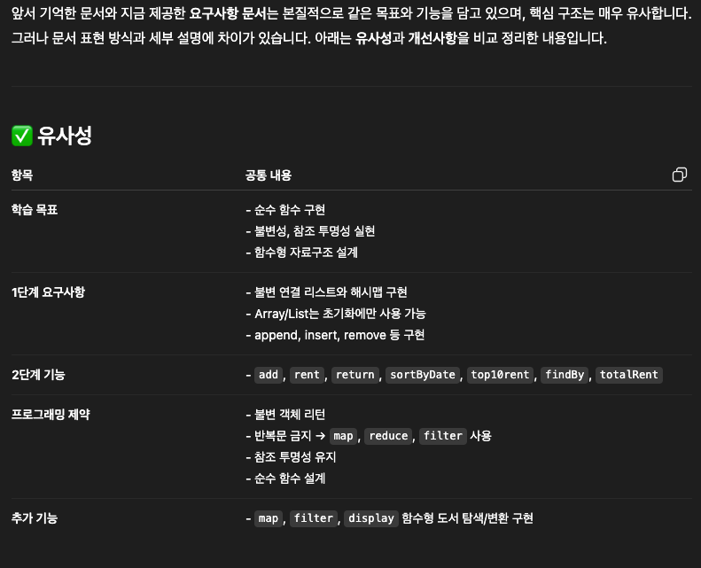
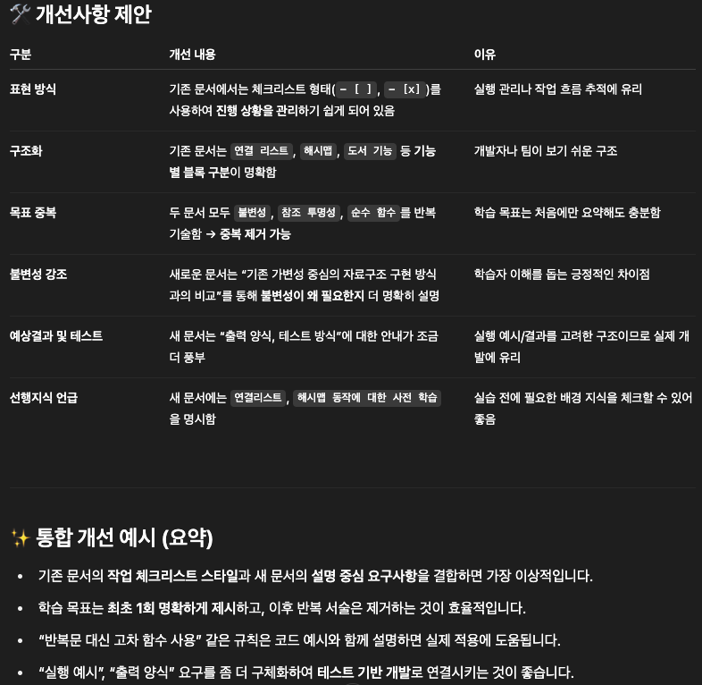

# 📒 relay_note74

⭐ === 캠퍼 4명이 모두 공감했던 답변

### ⁉️ Question 1

- 네부캠 챌린지에서의 성장 목표

### ‼️ Answer

- 하드 스킬과 소프트 스킬을 모두 겸비한 개발자가 일하고 싶은 개발자라고 생각해서 두 부분에서의 성장을 이루고 싶다.
- ⭐ 하지만 매일 미션마다 학습과 구현 모두 시간이 너무 오래 걸려서 두 마리 토끼를 다 잡으려면 문제를 보고 학습과 구현 정도를 잘 정할 수 있어야 할 것 같다.

### ⁉️ Question 2

- 네부캠 챌린지 1주차를 진행하면서 어려웠던 점

### ‼️ Answer

- 베이직 때와 다르게 학습할 것도, 구현할 것도 많아서 힘들었다.
- 문제를 분석하고 설계하는 것이 어려웠다.
- 내가 설정하고 수행하고 있는 체크포인트가 필요한 것인지 야크 털을 깎는 것인지 판단하기 어렵다.
- ⭐ 2시까지 요구사항 분석, 설계, 체크포인트 작성을 하라는 것을 보면 A-Z까지 완벽하게 하는 것이 아닌 적정한 수준이 있을 것 같은데, 그 수준을 정하기 이전에 키워드, 학습 목표, 요구사항을 이해하는 것도 어려워서 가이드라인이 있었으면 좋겠다.

### ⁉️ Question 3

- 위 목표와 어려움을 해결하기 위해 AI를 어떤 식으로 사용할 수 있을 것 같은지

### ‼️ Answer

- ⭐ 미션의 학습 목표나 키워드를 보고 학습을 어느 수준까지 해야될지, 이 학습 목표를 위해서는 이 키워드의 어떤 부분들을 알면 좋을지 추천해주는 봇
- 체크 포인트를 입력하면 이 미션의 의도와 알맞는지 판단해주는 봇, 이 체크 포인트를 수행하는데 설정한 시간이 지나면 알림을 띄워주는 AI

## 💡 결론

- 매일 미션마다 이론적인 학습과 문제 해결 능력을 기르려면 주어진 시간 내에 효율적으로 미션을 수행하는 것이 필요하다.
- 이를 위해 12-2시까지 프로그램 내에서 주어진 학습 목표, 체크 포인트 등을 설정하는데 가이드라인을 잡아주거나 어떤 생각의 흐름을 가지면 좋을지 질문을 던져주는 네부캠 12-2시 헬퍼 봇을 만들자!

# ✅ 퀘스트

- [ ] 12:00 - 14:00 사이에 피어 피드백 팀원 한명에게 체크 포인트 작성 의도 질문하고 답변해보기

  - 목적 : 12:00 - 14:00 사이에 적정한 수준의 학습 내용, 설계, 체크 포인트를 작성해야 하는데, 어떤 도움을 받으면 효율적인 2시간이 될 수 있을지 실험

  - 달성 기준 : 체크 포인트 작성 방향성에 도움이 됐다면 달성

- [ ] 요구사항, 학습목표, 키워드를 보고 본인이 작성한 체크포인트와 AI에 요구사항, 학습목표, 키워드를 입력해서 만들어주는 체크포인트와 비교해보기

  - 목적 : 본인이 작성하는 체크포인트가 AI가 생각하는 체크포인트와 얼마나 유사한지, 내가 생각한 방향이 얼마나 맞았고 틀렸는지에 대한 판단을 AI가 잘 해주는지 실험

  - 달성 기준 : 본인이 어떤 부분을 놓쳤고, 어떤 의도는 잘 파악했는지 판단 할 수 있다면 달성

- [ ] 요구사항, 학습목표, 키워드를 입력해서 AI가 만든 체크포인트를 추후에 나오는 길잡이 자료의 체크포인트와 비교해서 검증해보기

  - 목적 : AI 만들어준 키워드가 미션에서 의도한 키워드 일치하는 확인하기 위함

  - 달성 기준 : 겹치는 키워드가 30% 이상이다.

- [ ] AI를 사용하지 않고 요구사항 분석, 설계, 체크포인트를 작성한 날과 AI를 사용해서 작성한 날의 완료 시간 비교해보기

  - 목적 : 실제로 ai를 통한 요구사항 분석, 설계, 체크포인트가 시간 단축에 도움이 되었는지 확인해보기 위함

  - 달성 기준 : 시간이 20분 이상 단축되었다. (점심을 더 맛있게 먹을 수 있게 되었다☺️)

---

# 미션 수행 결과
- 팀 번호: 69번
---
## J021 - 권수현

---
## J183 - 이민구

  
6일차 퀘스트: 요구사항, 학습목표, 키워드를 보고 본인이 작성한 체크포인트와 AI에 요구사항, 학습목표, 키워드를 입력해서 만들어주는 체크포인트와 비교해보기

  

    
    
  

  
7일차 퀘스트: 요구사항, 학습목표, 키워드를 보고 본인이 작성한 체크포인트와 AI에 요구사항, 학습목표, 키워드를 입력해서 만들어주는 체크포인트와 비교해보기

  

    
    
    
  

  
8일차 퀘스트: 요구사항, 학습목표, 키워드를 보고 본인이 작성한 체크포인트와 AI에 요구사항, 학습목표, 키워드를 입력해서 만들어주는 체크포인트와 비교해보기

  

    
    
  

---
## J196 - 이승지

---
## S039 - 최현우

---
